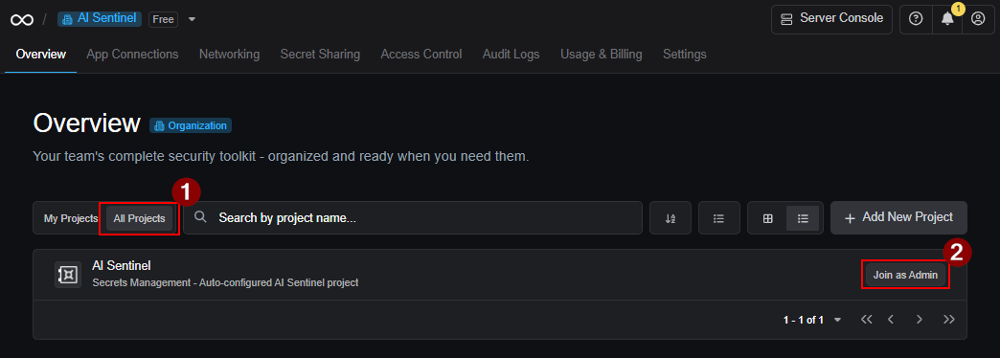
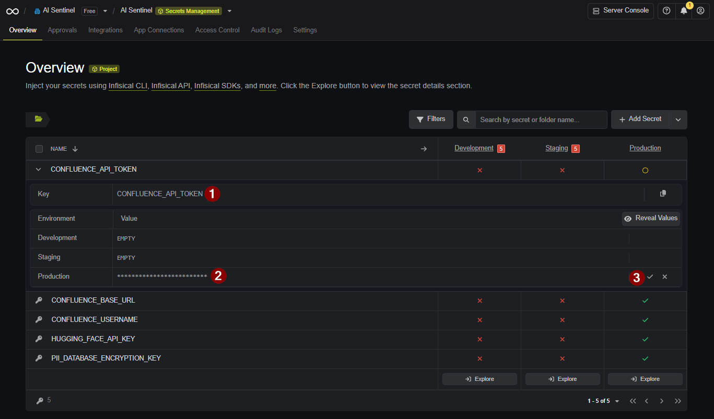

# AI Sentinel

[](https://github.com/Softcom-Technologies-Organization/ai-sentinel/releases)
[](LICENSE)
[](https://www.docker.com/)
[](https://www.python.org/)
[](https://openjdk.org/)
[](https://angular.io/)

> Intelligent platform for detecting and analyzing Personally Identifiable Information (PII) in Confluence spaces, powered by advanced AI models

## Table of Contents

- [About](#about)
- [Features](#features)
- [Architecture](#architecture)
- [Prerequisites](#prerequisites)
- [Infisical Installation and Configuration](#infisical-installation-and-configuration)
  - [Quick Setup Guide (3 Simple Steps)](#quick-setup-guide-3-simple-steps)
  - [Infisical Troubleshooting](#infisical-troubleshooting)
  - [Optional: Advanced Configuration](#optional-advanced-configuration)
  - [Security Notes](#security-notes)
  - [AI Models Configuration](#ai-models-configuration)
  - [Installation Troubleshooting](#installation-troubleshooting)
- [Usage](#usage)
- [Tests](#tests)
- [Contributing](#contributing)
- [Support](#support)
- [Frequently Asked Questions](#frequently-asked-questions)
- [License](#license)

## About

**AI Sentinel** is a comprehensive solution for detecting and analyzing Personally Identifiable Information (PII) in Confluence spaces. The application combines multiple state-of-the-art artificial intelligence models to accurately identify sensitive data and generate detailed reports.

**Context:** In a strict regulatory environment (GDPR, data protection), organizations must identify and protect personal information stored in their document management systems.

**Problem Solved:** AI Sentinel automates PII detection in Confluence spaces, identifying names, emails, addresses, phone numbers, credit cards, and other sensitive data.

**Solution:** The application uses a multi-model approach (GLiNER, Presidio, regex patterns) with a modern microservices architecture to scan, analyze, and report detected PII.

**Added Value:**
- ✅ Multi-language detection (FR, EN, etc.)
- ✅ Multiple AI models combined for optimal accuracy
- ✅ Intuitive user interface with real-time visualization
- ✅ Simple deployment via Docker Compose
- ✅ Hexagonal architecture for maximum maintainability

## Features

- ✅ **Multi-model PII detection**: Combines GLiNER, Presidio, and regex patterns for accurate detection
- ✅ **Confluence support**: Automatic scanning of Confluence spaces, pages, and content
- ✅ **Modern Web interface**: Angular dashboard with real-time scan visualization
- ✅ **Detailed reports**: Report generation with statistics and PII location
- ✅ **Microservices architecture**: Python (gRPC), Java (Spring Boot), and Angular services
- ✅ **Scan management**: Pause, resume, and real-time tracking of ongoing scans
- ✅ **PostgreSQL database**: Persistent storage of results and history
- 🚧 **Report export** (in progress): CSV/PDF export of scan results
- 📋 **Alerts and notifications** (planned): Real-time notifications when critical PII are detected

## Architecture

### Overview

AI Sentinel consists of the following components orchestrated via Docker Compose:  
  


### Project Structure

```
ai-sentinel/
├── pii-detector-service/       # Python PII detection service (gRPC)
│   ├── pii_detector/           # Detector source code
│   ├── config/                 # Model configurations
│   ├── tests/                  # Unit and integration tests
│   └── Dockerfile
├── pii-reporting-api/          # Spring Boot Backend API
│   ├── src/main/java/          # Java source code
│   ├── init-scripts/           # SQL initialization scripts
│   └── Dockerfile
├── pii-reporting-ui/           # Angular interface
│   ├── src/app/                # Angular source code
│   └── Dockerfile
├── proto/                      # Protocol Buffers definitions
├── docker-compose.dev.yml      # Compose for development
├── docker-compose.prod.yml     # Compose for production
└── README.md
```

### Technologies Used

- **Frontend**: Angular 19, TypeScript, TailwindCSS
- **Backend**: Spring Boot 3, Java 21, Armeria (gRPC client)
- **Detector**: Python 3.13, gRPC, Hugging Face Transformers
- **Database**: PostgreSQL 18
- **Infrastructure**: Docker, Docker Compose
- **AI Models**: GLiNER, Presidio, regex patterns

## Prerequisites

Before starting, make sure you have:

- **Docker Desktop**: Version 20.10 or higher
  ```bash
  # Check Docker version
  docker --version
  ```
  📖 [Docker Desktop Installation Guide](https://docs.docker.com/get-docker/)
  
  **Simplified Installation:**
  - 🪟 Windows: [Docker Desktop for Windows](https://docs.docker.com/desktop/install/windows-install/)
  - 🍎 macOS: [Docker Desktop for Mac](https://docs.docker.com/desktop/install/mac-install/)
  - 🐧 Linux: [Docker Engine for Linux](https://docs.docker.com/engine/install/)

- **Docker Compose**: Version 2.0 or higher (included with Docker Desktop)
  ```bash
  # Check Docker Compose version
  docker compose version
  ```

- **Confluence Credentials**: To scan your Confluence spaces (stored in Infisical)
  - Base URL of your Confluence instance
  - Username or email
  - Confluence API token ([How to create a token](https://support.atlassian.com/atlassian-account/docs/manage-api-tokens-for-your-atlassian-account/))

- **Hugging Face API Key**: (to be stored in Infisical)
  - Create an account on [Hugging Face](https://huggingface.co/join)
  - Generate an API key in [Settings > Access Tokens](https://huggingface.co/settings/tokens) _(token type: read)_

**Optional but recommended:**
- Git (to clone the repository in development mode)
- 16 GB RAM minimum (for AI models)
- Stable internet connection (model downloads: ~2 GB)

## Infisical Installation and Configuration

AI Sentinel uses **Infisical** for secure secrets management. No `.env` files are used.

### ✨ Simplified Setup with Automatic Bootstrapping

**AI Sentinel now automatically configures Infisical for you!** The setup has been greatly simplified thanks to automated bootstrapping.

### Quick Setup Guide (3 Simple Steps)

#### Step 1: Start AI Sentinel with Docker Compose

**Production mode:**
```bash
docker compose up -d
```

**Development mode:**
```bash
docker compose -f docker-compose.dev.yml up -d
```

The `ai-sentinel-infisical-configurator` container will automatically:
- ✅ Create the Infisical instance
- ✅ Create a Super Admin account
- ✅ Create the `ai-sentinel` project
- ✅ Create the necessary environments (dev/prod)
- ✅ Create a Machine Identity with credentials
- ✅ Configure authentication settings

#### Step 2: Retrieve Your Super Admin Credentials

Watch the logs to get your Super Admin credentials:

```bash
# Follow the configurator logs in real-time
docker logs -f ai-sentinel-infisical-configurator
```

**Look for these lines in the output:**

```
[infisical-config] ========================================
[infisical-config] Super Admin Account:
[infisical-config]   Email:    admin@ai-sentinel.local
[infisical-config]   Password: xxxxxxxxxxxxxxxxxxx
[infisical-config] ========================================
```

**⚠️ Important:** Save these credentials securely - you'll need them to access the Infisical UI.

**Alternative - View logs after container finished:**

**Linux/macOS:**
```bash
# If the container has already stopped
docker logs ai-sentinel-infisical-configurator 2>&1 | grep -A 3 "Super Admin Account"
```

**Windows PowerShell:**
```powershell
# If the container has already stopped
docker logs ai-sentinel-infisical-configurator 2>&1 | Select-String -Pattern "Super Admin Account" -Context 0,3
```

#### Step 3: Configure Your Secrets in Infisical UI

**3.1. Login to Infisical**

- **Development:** Open http://localhost:8082
- **Production:** Open your Infisical instance URL

Use the Super Admin credentials from Step 2.


**3.2. Join the AI Sentinel Project as Admin**

After login, you'll see the `ai-sentinel` project has been created automatically.

Click **"Join as Admin"** to access the project.



**3.3. Configure the 4 Required Secrets**

Navigate to the Secrets section and add the following 4 secrets:



| Secret Name | Description                                    | Example | Required         |
|-------------|------------------------------------------------|---------|------------------|
| `CONFLUENCE_BASE_URL` | Your Confluence instance URL                   | `https://company.atlassian.net/wiki` | ✅ Yes            |
| `CONFLUENCE_USERNAME` | Confluence email or username                   | `user@company.com` | ✅ Yes            |
| `CONFLUENCE_API_TOKEN` | Confluence API token                           | `ATATT3xFfGF0...` | ✅ Yes            |
| `HUGGING_FACE_API_KEY` | Hugging Face API key (for private models)      | `hf_...` | ✅ Yes            |
| `PII_DATABASE_ENCRYPTION_KEY` | Database encryption base for stored PII values | `hf_...` | ✅ Auto generated |

*Optional but recommended for accessing gated models.

**How to get Confluence credentials:**
- **Base URL:** Your Confluence instance (Cloud or Server/Data Center)
- **API Token:** Create at https://id.atlassian.com/manage-profile/security/api-tokens

**How to get Hugging Face API Key:**
- Create account at https://huggingface.co/join
- Generate token at https://huggingface.co/settings/tokens (token type: read)

#### Step 4: Restart Application Components

Once you've configured the secrets in Infisical, restart the application containers to load them:

```bash
docker compose up -d --force-recreate pii-detector pii-reporting-api pii-reporting-ui
```

**Or for development mode:**
```bash
docker compose -f docker-compose.dev.yml up -d --force-recreate pii-detector pii-reporting-api pii-reporting-ui
```

The services will now:
- ✅ Authenticate with Infisical using the auto-generated Machine Identity
- ✅ Load the secrets you configured
- ✅ Start successfully with proper configuration

**Verify services are running:**
```bash
docker compose ps
```

You should see all services in "Up" status.

---

### 🎉 That's It!

Your AI Sentinel instance is now fully configured and ready to use!

Access the application at:
- 📱 **Web Interface**: http://localhost:4200
- 🔌 **Backend API**: http://localhost:8080/ai-sentinel
- 🔐 **Infisical UI**: http://localhost:8082

### Infisical Troubleshooting

**401/403 from Infisical:**
- Verify the Machine Identity (client ID/secret) is correct
- Ensure the identity has been added to the project
- Check the Project ID file contains the correct value
- Verify the identity has proper permissions (Admin or appropriate role)

**Missing variables at runtime:**
- Ensure variables exist in the correct Infisical environment (dev/prod)
- Check the docker-compose service uses the matching `INFISICAL_ENV` value
- View service logs to see which secrets failed to load:
  ```bash
  docker logs pii-reporting-api | grep Infisical
  ```

**Self-hosted Infisical not starting:**
- Ensure the internal secrets exist in `secrets/` folder (see `secrets/README.md` for `ENCRYPTION_KEY`, `AUTH_SECRET`, DB password generation)
- Check Infisical logs: `docker logs infisical`
- Verify PostgreSQL is healthy: `docker ps --filter name=infisical-db`
- Restart the infisical service: `docker-compose restart infisical`

**Secrets not loading in application:**
```bash
# 1. Verify secret files exist
ls -la secrets/

# 2. Check secrets are mounted in container
docker exec pii-reporting-api ls -la /run/secrets/

# 3. Verify Infisical authentication succeeded
docker logs pii-reporting-api 2>&1 | grep -i "infisical\|secret"

# 4. Check Infisical service health
curl http://localhost:8082/api/status
```

---

### Optional: Advanced Configuration

If you need to configure additional optional secrets (proxy, advanced settings), add them in Infisical:

**Optional Secrets (Confluence Proxy):**

| Secret Name | Description | Default | Required |
|-------------|-------------|---------|----------|
| `CONFLUENCE_ENABLE_PROXY` | Enable proxy | `false` | No |
| `CONFLUENCE_PROXY_HOST` | Proxy hostname | - | If proxy enabled |
| `CONFLUENCE_PROXY_PORT` | Proxy port | `8080` | No |
| `CONFLUENCE_PROXY_USERNAME` | Proxy username | - | If proxy auth |
| `CONFLUENCE_PROXY_PASSWORD` | Proxy password | - | If proxy auth |

**Optional Secrets (Advanced Configuration):**

| Secret Name | Description | Default | Required |
|-------------|-------------|---------|----------|
| `CONFLUENCE_CACHE_REFRESH_INTERVAL` | Cache refresh interval (ms) | `300000` | No |
| `CONFLUENCE_CACHE_INITIAL_DELAY` | Initial delay (ms) | `5000` | No |
| `CONFLUENCE_POLLING_INTERVAL` | Polling interval (ms) | `60000` | No |

### Security Notes

✅ **Best Practices:**
- All secrets are automatically encrypted at rest in Infisical
- Secrets are never stored in `.env` files or version control
- Machine Identity credentials are generated with strong entropy
- Use separate environments (dev/prod) for security isolation
- Rotate secrets regularly (recommended: every 90 days)

⚠️ **Important:**
- Save your Super Admin credentials securely (password manager recommended)
- The bootstrapping process runs once - subsequent starts will skip configuration
- For production deployments, consider using Infisical Cloud for high availability

### AI Models Configuration

Models are configured in `pii-detector-service/config/models/`:

- **GLiNER**: `gliner-pii.toml` - Main detection model
- **Presidio**: `presidio-detector.toml` - Microsoft Presidio detector
- **Regex**: `regex-patterns.toml` - Regex patterns for emails, phones, etc.

See [detailed model documentation](pii-detector-service/docs/CONFIG_MIGRATION.md) for more information.


### Installation Troubleshooting

**Issue: Docker is not running**
```bash
# Solution: Start Docker Desktop or Docker service
# Windows/macOS: Launch Docker Desktop
# Linux:
sudo systemctl start docker
```

**Issue: Port already in use (4200, 8080, etc.)**
```bash
# Solution 1: Stop the service using the port
# Windows:
netstat -ano | findstr :4200
taskkill /PID <PID> /F

# Linux/macOS:
lsof -ti:4200 | xargs kill -9

# Solution 2: Modify ports in docker-compose
# Edit docker-compose.yml and change external ports
```

**Issue: Docker images won't download**
```bash
# Solution: Check your connection and Docker credentials
docker login ghcr.io
```

**Issue: Failed to authenticate with Infisical**
```bash
# Solution 1: Verify Infisical secrets exist
ls -la secrets/
cat secrets/infisical_project_id.txt
cat secrets/infisical_dev_client_id.txt

# Solution 2: Check Infisical service is running
docker compose ps infisical
docker compose logs infisical

# Solution 3: Verify Machine Identity in Infisical UI
# Access http://localhost:8082 (dev) or https://app.infisical.com (cloud)
```

**Issue: Missing secrets at runtime**
```bash
# Verify secrets are mounted in containers
docker exec pii-reporting-api ls -la /run/secrets/

# Check Infisical authentication logs
docker logs pii-reporting-api | grep Infisical

# Ensure secrets exist in Infisical for the correct environment (dev/prod)
```

**Issue: PII Detector service is slow to start**
```
# Normal: First startup can take 5-10 minutes
# Service downloads AI models (~2 GB)
# Check progress:
docker compose logs -f pii-detector
```


## Usage

### Quick Start

**1. Access the web interface**

Open your browser at: http://localhost:4200

**2. Create a scan**

- Click "New Scan"
- Select the Confluence space to scan
- Configure scan parameters
- Click "Start Scan"

**3. Track scan in real-time**

The dashboard displays:
- Real-time progress
- Number of pages scanned
- PII detected by type
- Ability to pause/resume

**4. View results**

Once the scan is complete:
- View global statistics
- Explore PII detected per page
- Access Confluence pages directly

### Useful Docker Commands

**Service management:**
```bash
# Start application (production mode)
docker compose up -d

# Start application (development mode)
docker compose -f docker-compose.dev.yml up -d

# Stop application
docker compose -f docker-compose.dev.yml down

# Restart specific service
docker compose -f docker-compose.dev.yml restart pii-reporting-api

# View logs in real-time
docker compose -f docker-compose.dev.yml logs -f

# View logs for specific service
docker compose -f docker-compose.dev.yml logs -f pii-detector

# View service status
docker compose -f docker-compose.dev.yml ps

# Rebuild and restart (after code changes)
docker compose -f docker-compose.dev.yml up -d --build
```

**Data management:**
```bash
# Stop and remove data (volumes)
docker compose down -v

# Database backup
docker compose exec postgres pg_dump -U postgres ai-sentinel > backup.sql

# Restore database
docker compose exec -T postgres psql -U postgres ai-sentinel < backup.sql
```

**Cleanup:**
```bash
# Remove all stopped containers
docker container prune

# Remove all unused images
docker image prune -a

# Complete cleanup (warning: removes EVERYTHING)
docker system prune -a --volumes
```

### REST API Endpoints

**Backend API** available at http://localhost:8080/ai-sentinel

Main endpoints:

- `GET /ai-sentinel/api/scans` - List of scans
- `POST /ai-sentinel/api/scans` - Create a new scan
- `GET /ai-sentinel/api/scans/{id}` - Scan details
- `POST /ai-sentinel/api/scans/{id}/pause` - Pause a scan
- `POST /ai-sentinel/api/scans/{id}/resume` - Resume a scan
- `GET /ai-sentinel/actuator/health` - Health check
- `GET /ai-sentinel/swagger-ui.html` - Swagger documentation

**Example request:**
```bash
# Create a new scan
curl -X POST http://localhost:8080/ai-sentinel/api/scans \
  -H "Content-Type: application/json" \
  -d '{
    "spaceKey": "DS",
    "spaceName": "System Documentation",
    "maxPages": 100
  }'

# Check API health
curl http://localhost:8080/ai-sentinel/actuator/health
```

### gRPC PII Detector Service

**PII detection service** available at `localhost:50051`

The service exposes gRPC methods defined in `proto/pii_detection.proto`:

```protobuf
service PIIDetectionService {
  rpc DetectPII(PIIRequest) returns (PIIResponse);
  rpc DetectBatchPII(BatchPIIRequest) returns (BatchPIIResponse);
}
```

**Test gRPC service:**
```bash
# Install grpcurl (gRPC testing tool)
# macOS:
brew install grpcurl

# Linux:
curl -sSL "https://github.com/fullstorydev/grpcurl/releases/download/v1.8.9/grpcurl_1.8.9_linux_x86_64.tar.gz" | tar -xz -C /usr/local/bin

# Windows: Download from https://github.com/fullstorydev/grpcurl/releases

# List available services
grpcurl -plaintext localhost:50051 list

# Call DetectPII method
grpcurl -plaintext -d '{"text": "My email is john.doe@example.com"}' \
  localhost:50051 pii_detection.PIIDetectionService/DetectPII
```

### PgAdmin Access (optional)

PgAdmin is available for database administration:

**URL**: http://localhost:5050  
**Email**: admin@pgadmin.com  
**Password**: admin

**PostgreSQL connection configuration in PgAdmin:**
- **Host**: postgres
- **Port**: 5432
- **Database**: ai-sentinel
- **Username**: postgres
- **Password**: postgres

## Tests

### Python Service Tests (PII Detector)

The detection service has a comprehensive pytest test suite.

**Run all tests:**
```bash
cd pii-detector-service

# With coverage
pytest --cov=pii_detector --cov-report=html

# Specific tests
pytest tests/unit/test_gliner_detector.py -v

# Parallel tests
pytest -n auto
```

**Expected results:**
- ✅ 34+ unit tests
- ✅ Code coverage > 80%
- ✅ Integration tests for each detector

See the [detailed testing guide](pii-detector-service/README.md#tests-avec-pytest).

### Java Backend Tests

```bash
cd pii-reporting-api

# Run tests
mvn test

# With coverage
mvn test jacoco:report

# View report
open target/site/jacoco/index.html
```

### Angular Frontend Tests

```bash
cd pii-reporting-ui

# Unit tests
npm test

# E2E tests
npm run e2e

# With coverage
npm run test:coverage
```

## Contributing

Contributions are welcome! Here's how to participate:

### Contribution Process

1. **Fork** the project
2. **Create** a branch for your feature
   ```bash
   git checkout -b feature/AmazingFeature
   ```
3. **Commit** your changes
   ```bash
   git commit -m 'Add: Amazing feature'
   ```
4. **Push** to the branch
   ```bash
   git push origin feature/AmazingFeature
   ```
5. **Open** a Pull Request

### Code Conventions

- **Java**: Follow [Google Java Style Guide](https://google.github.io/styleguide/javaguide.html)
- **Python**: Follow [PEP 8](https://www.python.org/dev/peps/pep-0008/)
- **TypeScript/Angular**: Follow [Angular Style Guide](https://angular.io/guide/styleguide)
- **Commits**: Follow [Conventional Commits](https://www.conventionalcommits.org/)
  - `feat:` New feature
  - `fix:` Bug fix
  - `docs:` Documentation
  - `refactor:` Refactoring
  - `test:` Adding tests

### Hexagonal Architecture

The **pii-reporting-api** (Java Backend) follows hexagonal architecture principles. When contributing to this module, make sure to:
- ✅ Separate business logic from technical dependencies
- ✅ Use ports and adapters
- ✅ Maintain cyclomatic complexity < 7
- ✅ Write tests before refactoring

### Code of Conduct

We follow the [Contributor Covenant Code of Conduct](https://www.contributor-covenant.org/).

### Bug Reporting

Use [GitHub Issues](https://github.com/Softcom-Technologies-Organization/ai-sentinel/issues) with the appropriate template.

## Support

- 📧 **Email**: support@softcom-technologies.com
- 🐛 **Issues**: [GitHub Issues](https://github.com/Softcom-Technologies-Organization/ai-sentinel/issues)
- 📖 **Documentation**:
  - [Docker Installation Guide](https://docs.docker.com/get-docker/)
  - [PII Detector Documentation](pii-detector-service/README.md)
  - [Backend API Documentation](pii-reporting-api/README.md)
  - [UI Documentation](pii-reporting-ui/README.md)
- 🌐 **Website**: https://softcom-technologies.com

### Frequently Asked Questions

**Q: What types of PII are detected?**  
A: First names, last names, emails, phones, addresses, social security numbers, credit cards, dates of birth, and more.

**Q: Do models work offline?**  
A: Yes, after the first download, models are cached locally.

**Q: Can I use my own AI model?**  
A: Yes, see the [model configuration documentation](pii-detector-service/docs/CONFIG_MIGRATION.md).

**Q: How to secure detected data?**  
A: PII are never sent to external services. Everything is processed locally. Use HTTPS and secure your PostgreSQL database in production.

## License

This project is licensed under the MIT License - see the [LICENSE](LICENSE) file for details.

Copyright © 2025 Softcom Technologies

## Acknowledgments

- [Hugging Face](https://huggingface.co/) - For AI models and platform
- [Microsoft Presidio](https://github.com/microsoft/presidio) - For the PII detection framework
- [GLiNER](https://github.com/urchade/GLiNER) - For the generalist NER model
- [Spring Boot](https://spring.io/projects/spring-boot) - Backend framework
- [Angular](https://angular.io/) - Frontend framework
- All [contributors](https://github.com/Softcom-Technologies-Organization/ai-sentinel/graphs/contributors)

---

**Developed with ❤️ by [Softcom Technologies](https://softcom-technologies.com)**
