# Infisical UI Setup Guide for AI Sentinel

This guide explains how to configure Infisical using the Web UI for AI Sentinel. It covers:
- Creating a project and retrieving the Project ID
- Creating a Machine Identity and generating its Client ID/Secret
- Adding environment secrets required by each AI Sentinel component
- Saving required Docker secret files in the repository

All screenshots referenced below are available in docs/screenshots.

---

## 1) Sign up and sign in

- Open the Infisical UI in your browser:
  - Self‑hosted (development): http://localhost:8082
  - Infisical Cloud: https://app.infisical.com

Screenshots:

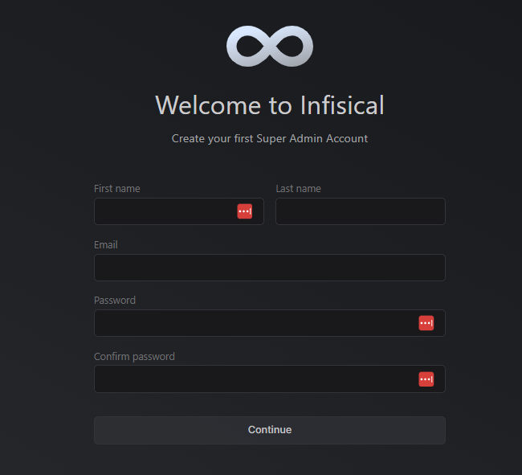
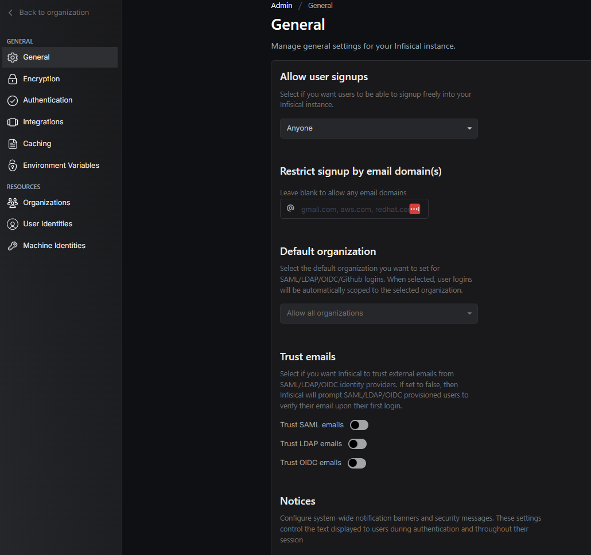

---

## 2) Create a project

- In the top navigation, open Projects and click Create Project
- Name it for example: AI Sentinel

Screenshots:

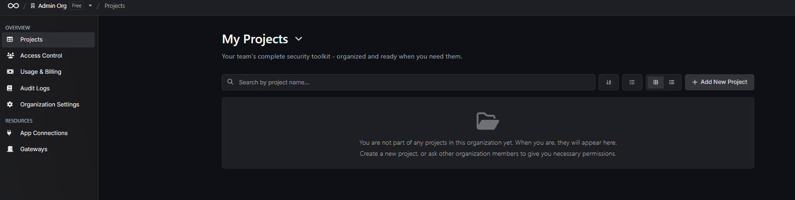
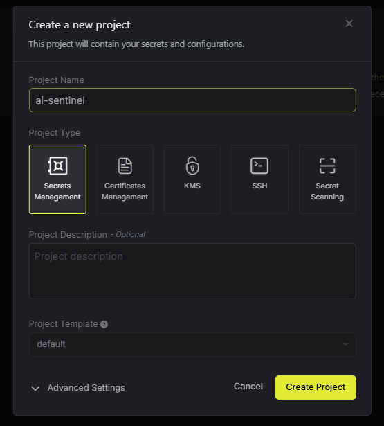

After creation, open the Project Settings. You will need the Project ID in the next step.

---

## 3) Save the Project ID for Docker (MANDATORY)

- In the project Settings page, copy the Project ID (a UUID-like value)
- Save it to the repository so Docker can mount it as a secret:

PowerShell (Windows):

```powershell
"YOUR_PROJECT_ID" | Set-Content -Path 'secrets/infisical_project_id.txt' -NoNewline -Encoding ASCII
```

Bash (Linux/Mac):

```bash
echo -n "YOUR_PROJECT_ID" > secrets/infisical_project_id.txt
```

This is required by docker-compose (both dev and prod) to authenticate the services with Infisical.

---

## 4) Create a Machine Identity and generate credentials

- Go to your project → Settings → Access Control → Machine Identities
- Click + Add Identity
- Choose a meaningful name, for example:
  - ai-sentinel-dev (Environment: dev)
  - ai-sentinel-prod (Environment: prod)
- Assign a role (Admin for simplicity; you can tighten later with fine-grained permissions)
- Open the identity details → Authentication tab (Universal Auth)
- Generate a Client Secret
- Copy BOTH values now:
  - Client ID
  - Client Secret (will be shown only once)

Screenshots (navigation and details):


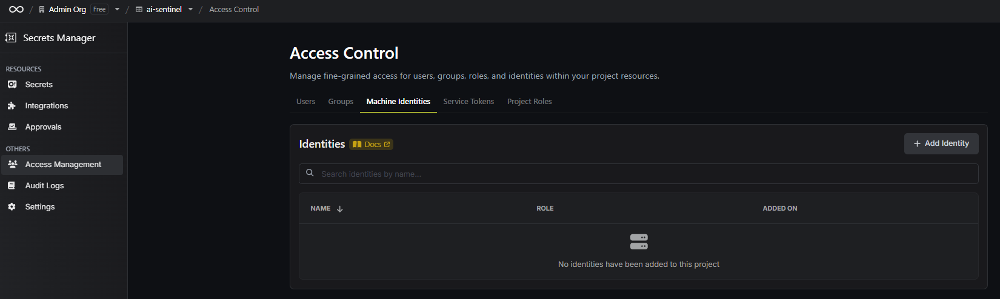
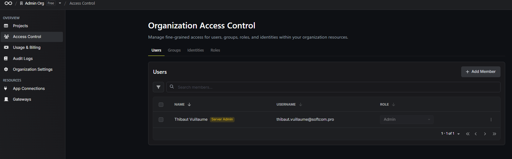
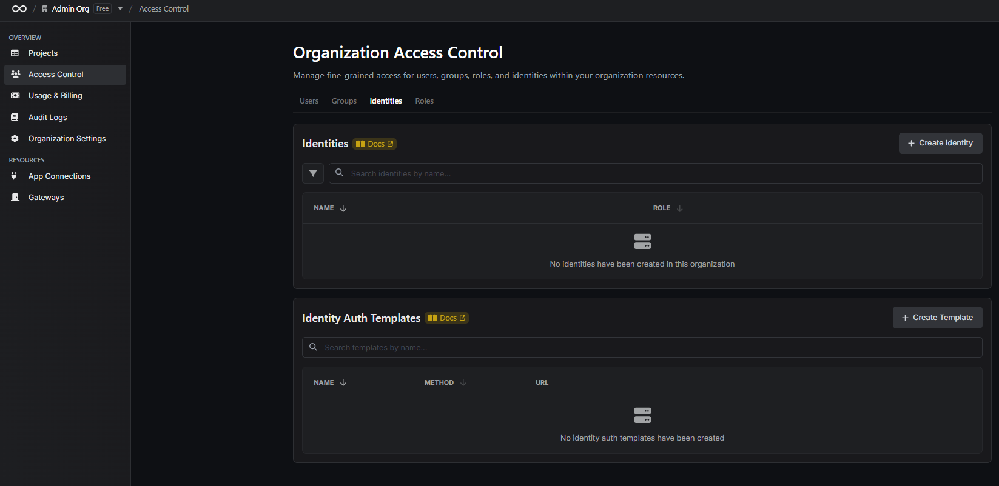
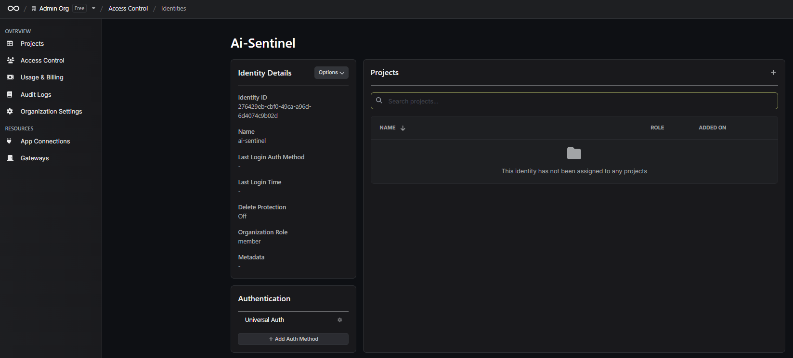
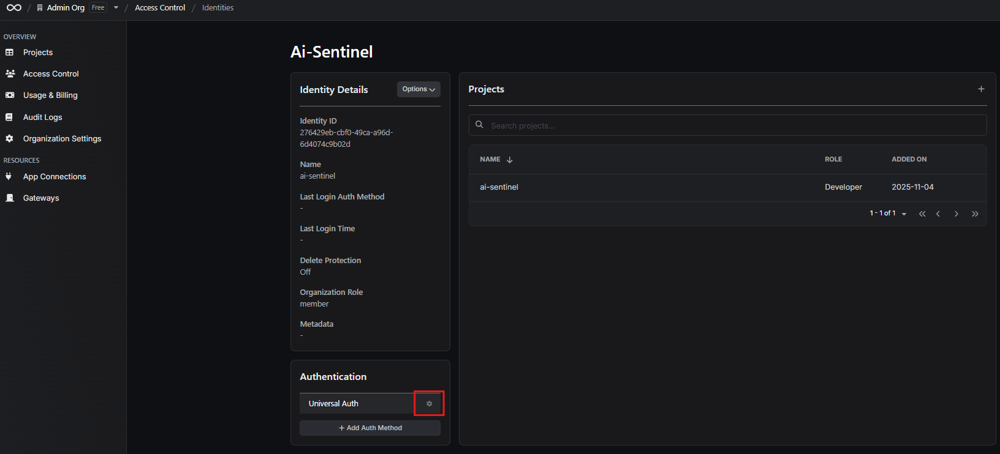
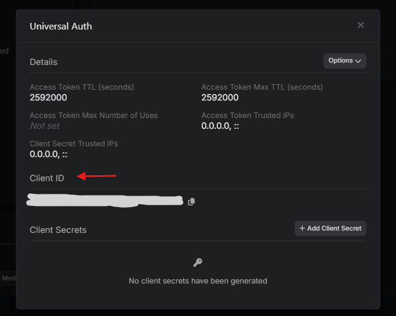
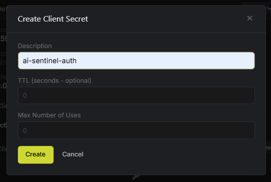
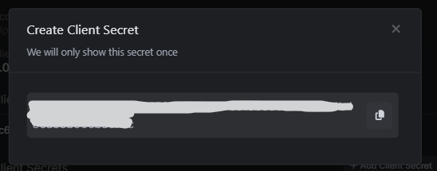

Finally, ensure the identity is added to the project:

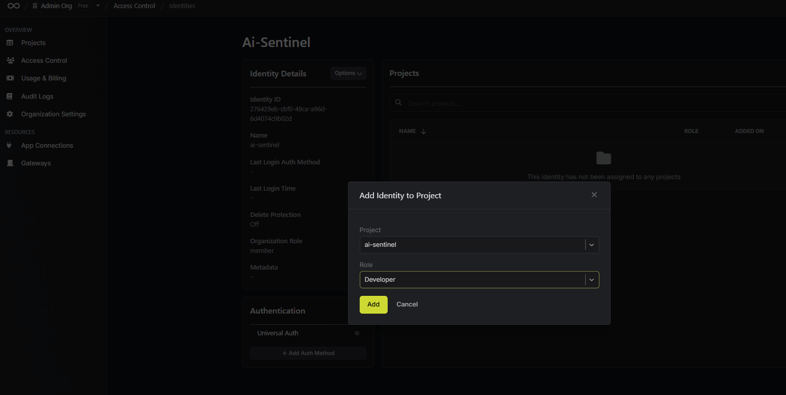

### Save the Machine Identity credentials as Docker secrets

Save credentials to files under the repository's secrets folder so docker-compose can mount them:

For the DEV environment identity (recommended during development):

PowerShell (Windows):

```powershell
"YOUR_CLIENT_ID" | Set-Content -Path 'secrets/infisical_dev_client_id.txt' -NoNewline -Encoding ASCII
"YOUR_CLIENT_SECRET" | Set-Content -Path 'secrets/infisical_dev_client_secret.txt' -NoNewline -Encoding ASCII
```

Bash (Linux/Mac):

```bash
echo -n "YOUR_CLIENT_ID" > secrets/infisical_dev_client_id.txt
echo -n "YOUR_CLIENT_SECRET" > secrets/infisical_dev_client_secret.txt
```

For the PROD environment identity (if you plan production):

PowerShell (Windows):

```powershell
"YOUR_CLIENT_ID" | Set-Content -Path 'secrets/infisical_prod_client_id.txt' -NoNewline -Encoding ASCII
"YOUR_CLIENT_SECRET" | Set-Content -Path 'secrets/infisical_prod_client_secret.txt' -NoNewline -Encoding ASCII
```

Bash (Linux/Mac):

```bash
echo -n "YOUR_CLIENT_ID" > secrets/infisical_prod_client_id.txt
echo -n "YOUR_CLIENT_SECRET" > secrets/infisical_prod_client_secret.txt
```

---

## 5) Add required application secrets inside Infisical

Create these variables in your Infisical project for each target environment (dev and/or prod). The services will fetch them at runtime via Infisical CLI.

### PII Reporting API (Spring Boot)

Required secrets:

- CONFLUENCE_BASE_URL
  - What: Your Confluence base URL (example: https://company.atlassian.net/wiki)
  - Where to find: Your Confluence instance URL (Cloud or Server/Data Center)
- CONFLUENCE_USERNAME
  - What: Account email or username used to access Confluence
  - Where to find: Your Atlassian account (id.atlassian.com) or corporate directory
- CONFLUENCE_API_TOKEN
  - What: Confluence API token for the above user
  - Where to find (Atlassian Cloud): https://id.atlassian.com/manage-profile/security/api-tokens → Create token
- Optional proxy values (only if your Confluence is reachable via a proxy):
  - CONFLUENCE_ENABLE_PROXY (true/false)
  - CONFLUENCE_PROXY_HOST
  - CONFLUENCE_PROXY_PORT (default 8080 if omitted)
  - CONFLUENCE_PROXY_USERNAME
  - CONFLUENCE_PROXY_PASSWORD

Notes:
- Database connectivity to Postgres is configured via docker-compose and is not stored in Infisical by default in this project. You may choose to manage DB_* variables in Infisical later if needed.

### PII Detector Service (Python)

- No mandatory secrets by default. Model configs and caches are handled via environment variables set in docker-compose. If your models require private access (e.g., Hugging Face tokens), you could add HF_TOKEN or similar to Infisical and consume it in your service wrapper.

---

## 6) Start the stack (development)

Once the files in secrets/ are saved and the Infisical project is configured:

```bash
docker-compose -f docker-compose.dev.yml up -d infisical
# Wait until Infisical is healthy
# Then start the rest of the stack
docker-compose -f docker-compose.dev.yml up -d
```

The services will:
- Read Machine Identity credentials and Project ID from Docker secrets
- Authenticate to Infisical via Universal Auth
- Inject the configured project secrets into the runtime environment

---

## 7) Troubleshooting

- 401/403 from Infisical: Verify the Machine Identity (client ID/secret), project membership, and the Project ID file.
- Missing variables at runtime: Ensure variables exist in the correct Infisical environment (dev/prod) and the docker-compose service uses the matching INFISICAL_ENV value.
- Self-hosted Infisical not starting: Ensure the internal secrets exist in secrets/ folder (see secrets/README.md for ENCRYPTION_KEY, AUTH_SECRET, DB password generation) and restart the infisical service.

---

## Appendix: What each Docker secret file is used for

These files are mounted by docker-compose for runtime authentication with Infisical:

- secrets/infisical_project_id.txt → Project ID from Infisical UI project settings
- secrets/infisical_dev_client_id.txt → Machine Identity (dev) Client ID
- secrets/infisical_dev_client_secret.txt → Machine Identity (dev) Client Secret
- secrets/infisical_prod_client_id.txt → Machine Identity (prod) Client ID (if used)
- secrets/infisical_prod_client_secret.txt → Machine Identity (prod) Client Secret (if used)

If you self-host Infisical locally (development), the Infisical container also reads:

- secrets/infisical_encryption_key.txt → Server encryption key (hex, 32 chars)
- secrets/infisical_auth_secret.txt → Server auth secret (base64, 44 chars)
- secrets/infisical_db_password.txt → Password for Infisical's Postgres DB

For generation commands and details, see secrets/README.md.
