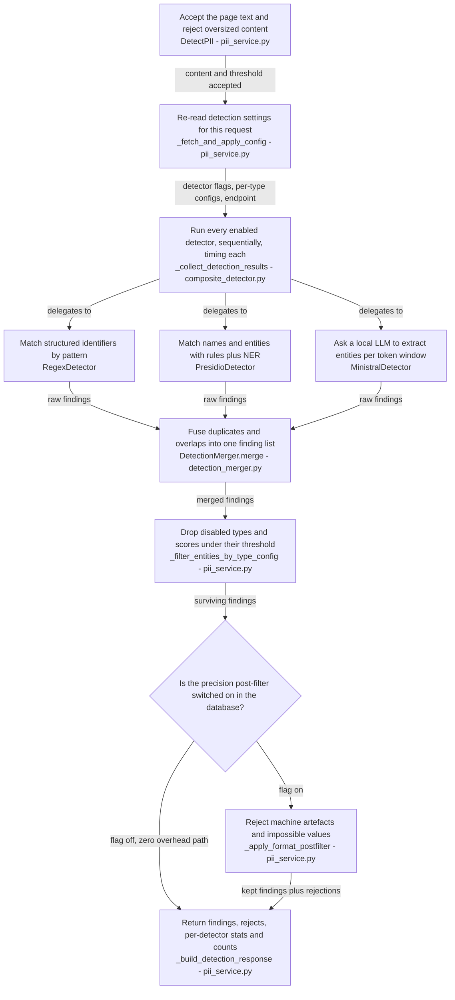

# Detection pipeline (`pii-detector-service`)

A Python gRPC service with one method, `DetectPII`. Everything interesting happens between receiving
a page's text and returning the findings: which detectors run, how their results are fused, and how
false positives are pruned without ever losing a real finding.

The guiding trade-off is stated everywhere in this module and should be respected in any change:
**recall is protected, precision is bought back deterministically.** Detectors are allowed to be
noisy; the filtering stages are allowed to reject only what they can prove wrong, and every stage
fails *open* (an exception keeps the entity).

## Request pipeline

Every stage logs a `[FINDING_TRACKER] step=…` line with an in/out count. When findings "disappear"
between the detector and the dashboard, grepping that tag through the detector logs localises the
stage that dropped them before any code reading is needed.

## The three detectors

`CompositePIIDetector` (`pii_detector/application/orchestration/composite_detector.py`) holds all
three, always instantiated at startup, each activated **per request** from the database flags. That
split is deliberate: model loading is expensive, toggling must be free.

| Detector | Nature | Enabled by | Notes |
|---|---|---|---|
| `RegexDetector` | Deterministic patterns | `regex_enabled` | Patterns in `config/models/regex-patterns.toml` |
| `PresidioDetector` | Microsoft Presidio, rules + spaCy NER | `presidio_enabled` | spaCy `en`/`fr`/`de` small models pinned in `pyproject.toml`; recognizers in `config/models/presidio-detector.toml` |
| `MinistralDetector` | Generative LLM extraction over HTTP | `ministral_enabled` | Talks to an OpenAI-compatible endpoint; **no local model** |

Detectors run **sequentially** inside a request. That is not an oversight — it is what makes
`DetectorRunStats.duration_ms` a truthful per-detector busy time that callers can sum across a scan.
Parallelism happens at a coarser grain (see *Throughput* below).

Each detector call is wrapped so a failure returns an empty list instead of propagating
(`_run_regex_detection`, `_run_presidio_detection`, `_run_ministral_detection`). An unreachable LM
Studio endpoint therefore degrades the scan to Presidio + Regex rather than failing it — silently,
apart from a logged `MINISTRAL_DETECTION_FAILED`.

### Ministral: an open vocabulary, and what that forces

`pii_detector/infrastructure/detector/ministral_detector.py` is the most subtle file in the service.
Read its module docstring first; it records the reasoning behind each choice.

- **Prompting**: the model is asked for a strict JSON array of `{text, label}` objects; each returned
  text is then located back in the source to recover character offsets.
- **Transport**: `httpx` with `http2=False` and `trust_env=False`. Both are load-bearing — LM Studio
  hangs on the h2c upgrade, and a LAN endpoint must never be routed through a corporate proxy.
- **Chunking**: long documents are cut into windows measured in **real tokens** by
  `MinistralTokenChunker` (the model's Hugging Face tokenizer), falling back to a character-ratio
  `FallbackChunker` when the tokenizer cannot be loaded (offline, no HF cache). Either way each chunk
  carries exact character offsets, so per-chunk offsets are rebased to global coordinates. Defaults:
  2048 tokens with 410 overlap, overridable per request from `ministral_chunk_size` /
  `ministral_overlap`.
- **Partial failure is tolerated**: a chunk that times out is logged and skipped, so one bad window
  never sinks the page.
- **Label resolution is layered** (`_LabelResolver`): exact `detector_label` match on the
  `pii_type_config` rows → case/format-insensitive match → known alias → **passthrough** of the
  normalised `UPPER_SNAKE` label. Nothing is dropped at this level; the decision is deferred to the
  type gate below, so passthrough can never resurrect a type an operator disabled.

## Merge

`DetectionMerger` (`pii_detector/domain/service/detection_merger.py`) deduplicates identical spans
keeping the highest confidence, then resolves overlaps preferring the longer span. It carries
optional provenance logging (`log_provenance` in `config/detection-settings.toml`).

Note: both `detection_merger.py` and `pii_service.py` still contain blocks marked
`TEMPORARY: parity recall investigation — remove with git revert` that emit verbose `[PARITY_DEBUG]`
logs. They are debugging scaffolding, not product behaviour — leave them alone unless the task is to
remove them, and do not build on their output.

## Type gate: the configured taxonomy wins

`_filter_entities_by_type_config` applies the `pii_type_config` rows:

1. A PII type disabled in configuration is dropped entirely.
2. A finding scoring below its **per-type** threshold is dropped.
3. A type with **no** configuration row is *kept* — except for `MINISTRAL`, where an unconfigured
   open-vocabulary label is dropped.

That last rule is the counterpart of Ministral's passthrough: the model may invent labels, but only
labels present in `pii_type_config` reach the dashboard.

## Precision post-filter

Gated by `postfilter_enabled` (a boolean column reused under its historical name), and lazily
imported so the disabled path allocates nothing. Located in
`pii_detector/infrastructure/postfilter/`, entry point `format_postfilter_validator.py`.

Two passes:

1. **Cross-label technical-artifact denylist** (`technical_artifact_denylist.py`) — rejects spans whose
   text is a recognisable machine artefact (UUID, Mongo ObjectId, MD5/SHA digests, W3C traceparent,
   version strings, base64 images) *whatever label* was attached. Necessary precisely because
   Ministral's passthrough labels (`OBJECT_ID`, `GUID`, `TRACE_ID`…) are never registered in the
   per-type registry, so the per-type strategies cannot see them.
2. **Per-`pii_type` strategies** (`registry.py` + `strategies/`) — reject mechanically impossible
   values: IBAN checksum, credit-card Luhn, Swiss AVS and UID checksums, SWIFT/BIC shape, MAC and IP
   parsing, and a credential-plausibility strategy (`credential_plausibility.py`, backed by
   `detect-secrets` and `zxcvbn`) for `PASSWORD`-family labels.

Rejections are not discarded quietly: they are returned in `discarded_entities` with a verdict,
confidence and reason (the proto fields keep their historical `judge_*` names from the removed
LLM-judge). That channel is what makes the post-filter's false-positive reduction measurable per type
and per detector.

Two contract details to be aware of when reading these statistics:

- The Python enum member is named `POSTFILTER` (`domain/entity/detector_source.py`) while the proto
  enum value is `PREFILTER = 7`. `_add_detector_stats_to_response` maps by member *name*
  (`getattr(pb2.DetectorSource, source.name, UNKNOWN_SOURCE)`), so post-filter statistics currently
  serialise as `UNKNOWN_SOURCE`. Verify against the wire before relying on a post-filter row in
  `scan_detector_stats`.
- `_add_entities_to_response` caps the response at **1000 entities** per request to bound payload
  size. A page with more findings is silently truncated.

**Carve-outs matter more than the rules.** The denylist docstring lists them: credential labels, JWTs
and known secret prefixes, values parsing as IPv4 or a plausible dotted date, `0x`-prefixed hex
(wallet addresses are financial PII), and composite spans whose context prefix looks like it embeds
real PII. Adding a rule without its carve-out is how recall gets lost. The unit suite in
`tests/unit/infrastructure/postfilter/` includes a **reference corpus** test
(`test_postfilter_reference_corpus.py`) with anonymised finding fixtures under
`tests/resources/ministral-postfilter/` — the regression net for exactly that risk.

## Throughput and concurrency

Three independent levers, easy to confuse:

| Lever | Where | What it parallelises |
|---|---|---|
| `pageConcurrency` (backend) | `AbstractStreamConfluenceScanUseCase`, `flatMapSequential` | Number of pages detected at once, i.e. concurrent `DetectPII` calls |
| `PII_WORKER_PROCESSES` (env) | `infrastructure/model_management/detector_worker_pool.py` | Process pool inside the detector, for CPU-bound inference |
| `ministral_concurrency` (DB) | `ministral_detector.py`, `_extract_chunks_concurrently` | Chunk prompts sent to LM Studio in parallel |

The worker pool has a hard constraint written into its docstring: on Linux it forks **after**
preloading the detector, so the parent must never run a forward pass before the fork (no live BLAS
threads); each worker warms up itself. Breaking that invariant produces hangs, not errors.

`ministral_concurrency` is auto-tuned at startup by
`infrastructure/model_management/concurrency_autotuner.py` against `bench_sample.txt`, and the result
is written back into the database (`ministral_concurrency`, `ministral_concurrency_auto`,
`ministral_concurrency_tuned_signature`). The benchmark can also be triggered on demand from the UI
through `ConcurrencyBenchmarkController`. Design notes:
`docs/superpowers/specs/2026-07-15-ministral-concurrency-autotune-design.md`.

Every phase emits a `[THROUGHPUT] phase=… chars=… chars_per_s=…` line, in the same format on both
sides of the gRPC boundary, so detector-side and backend-side throughput can be compared directly.

## Configuration precedence

1. **Database** (`pii_detection_config`, `pii_type_config`) — detector activation, global and per-type
   thresholds, label mapping, post-filter flag, Ministral chunking, LM Studio endpoint, concurrency.
   Read per request when `fetch_config_from_db = true`.
2. **TOML** (`config/detection-settings.toml`, `config/models/*.toml`) — everything the database does
   not own: regex patterns, Presidio recognizers, logging flags, chunk thresholds, in-process worker
   settings. `detection-settings.toml` documents in-file which keys have moved to the database.
3. **Environment** — `PII_DETECTOR_PORT`, `PII_DETECTOR_WORKERS`, `PII_WORKER_PROCESSES`,
   `DB_HOST`/`DB_PORT`/`DB_NAME`/`DB_USER`/`DB_PASSWORD`.

`DB_HOST` defaults to `postgres`, the Compose service name. Running the detector outside Compose
without setting it produces the classic symptom of a scan that completes with **zero detections**:
the config fetch fails, the fallback returns `None`, and every detector flag defaults to off.

## Changing this service

- **Adding a detector**: implement `PIIDetectorProtocol`
  (`domain/port/pii_detector_protocol.py`), add a `DetectorSource` enum value in **both**
  `domain/entity/detector_source.py` and `proto/pii_detection.proto` (never reuse a reserved tag),
  wire it in `CompositePIIDetector`, add its enable flag through the four-place path described in
  [System overview](system-overview.md), and add the enum on the Java and Angular sides — an unmapped
  source surfaces in the UI as `UNKNOWN_SOURCE`.
- **Adding a post-filter rule**: a strategy in `postfilter/strategies/` plus its registry entry, and
  the carve-outs. Verify against the reference corpus before anything else.
- **Regenerate stubs after any proto change**: `python -m pii_detector.proto.generate_pb`. The
  generated files are gitignored; a stale stub raises `AttributeError` on a field that exists in the
  proto.
- **Tests**: `pytest tests/unit` is fast and hermetic. `tests/integration/` includes tests that need a
  database or a live LM Studio endpoint; check the test's own skip conditions before assuming a
  failure is a regression.
