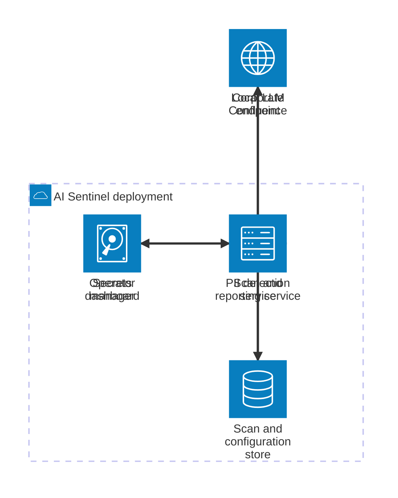

# System overview

Three services, one shared database, one shared gRPC contract. Everything sensitive stays inside the
deployment perimeter.

## Runtime topology



What each box is, and what each arrow carries:

- **Operator dashboard** (`pii-reporting-ui/src/app`) → **Scan and reporting service**: REST calls for
  spaces, settings and remediation, one Server-Sent-Events stream per scan for live findings, and a
  status poll that is the authoritative source for scan state. See
  [Frontend UI](frontend-ui.md).
- **Scan and reporting service** (`pii-reporting-api`) → **Corporate Confluence**: reads spaces, pages
  and attachments over the Confluence REST API; writes back only when a redaction job runs
  (`ConfluencePageRedactionAdapter`).
- **Scan and reporting service** → **PII detection service**: one synchronous `DetectPII` gRPC call
  per page or attachment, over Armeria by default
  (`GrpcPiiDetectorArmeriaClientAdapter`, `ArmeriaGrpcPiiTransport`).
- **Scan and reporting service** → **Scan and configuration store**: owns the schema; persists scan
  events with encrypted PII values, checkpoints, per-space and per-type counters, remediation rows,
  and the detection configuration edited from the UI.
- **PII detection service** → **Scan and configuration store**: reads the detection configuration
  directly, per request (`database_config_adapter.py`). It never writes scan data; it does write back
  the auto-tuned Ministral concurrency.
- **PII detection service** → **Local LLM endpoint**: an OpenAI-compatible `/chat/completions`
  endpoint (LM Studio) serving the Ministral-PII model (`ministral_detector.py`). Host and port come
  from the database, so an operator can retarget it without a restart.
- Both services → **Secrets manager**: Infisical supplies database credentials and the encryption key
  at container start (`pii-reporting-api/docker-entrypoint.sh`,
  `pii-detector-service/docker-entrypoint.sh`).

## The database is the configuration bus

This is the single most important structural fact about the system. The detection service has **no
API to configure it**: the backend does not push settings, and the detector does not cache them
across scans.

1. The operator edits detection settings in the UI (`pii-settings`), which `PUT`s to
   `/api/v1/pii-detection/config` and `/api/v1/pii-detection/pii-types`.
2. The backend persists them in `pii_detection_config` (single row, `id = 1`) and `pii_type_config`
   (one row per detector × PII type).
3. On every `DetectPII` call the backend sets `fetch_config_from_db = true`
   (`proto/pii_detection.proto`, field 3).
4. The detector re-reads both tables for that request and applies them: which detectors run, the
   global threshold, per-type thresholds, the label→`pii_type` mapping, the post-filter flag, the
   Ministral chunking knobs, the LM Studio endpoint and the prompt concurrency.

Consequences to keep in mind when changing anything:

- **A new detection setting is a four-place change**: SQL migration in
  `pii-reporting-api/init-scripts/`, JPA entity + DTO + use case in the backend, the read in
  `database_config_adapter.py` (plus its `UndefinedColumn` fallback), and the settings form in the UI.
  Commit `6ce7d7a9` (LM Studio endpoint) and `cc9039f6` (Ministral concurrency) are both worked
  examples of that shape.
- `database_config_adapter.py` reads new columns **defensively**: an `psycopg2.errors.UndefinedColumn`
  triggers a fallback query with hard-coded defaults, so a detector running against a database whose
  migration has not been applied degrades instead of failing. That fallback must be extended
  alongside any new column, or the new setting silently reverts to its default.
- Because configuration is read per request, a setting changed mid-scan takes effect on the **next
  page**, not on the whole scan. Nothing re-scans already-processed pages.

## Contract between backend and detector

`proto/pii_detection.proto` is the only interface. It is worth reading in full — it is short and its
comments record several deliberate decisions:

- One RPC: `DetectPII(PIIDetectionRequest) → PIIDetectionResponse`.
- Removed detectors are **reserved, not deleted**: enum tags `1`, `4`, `5`, `6` and the names
  `GLINER`, `OPENMED`, `GLINER2`, `JUDGE` can never be reused. Live sources are `PRESIDIO`, `REGEX`,
  `MINISTRAL`, plus the pseudo-source `PREFILTER` used only to report post-filter statistics.
- `PIIEntity` field 8 (`judge_status`) is reserved: the LLM-as-judge post-filter was removed.
- The response carries four observability channels beyond the entities themselves:
  `discarded_entities` (what the post-filter rejected, with a reason), `detector_stats` (per-detector
  busy time and counts), `discovered_labels` (open-vocabulary labels Ministral proposed that have no
  configuration row), and `summary` (counts per type).

The Java stubs are generated from this file by the Maven build; the Python stubs are generated by
`python -m pii_detector.proto.generate_pb` into `pii_detector/proto/generated/` and are **not
committed**. A stale generated stub is a recurring failure mode: the service raises
`AttributeError` on a field the proto declares. Regenerate after every proto change, on both sides.

## Hexagonal architecture, enforced

Both backend services use the same layering, and the Java one enforces it in CI.

- `domain/` — records, enums, invariants, no framework import.
- `application/` — use cases and the ports they depend on (`port/in`, `port/out`).
- `infrastructure/` — adapters: REST/SSE controllers under `adapter/in`, JPA / HTTP / gRPC clients
  under `adapter/out`, Spring `@Configuration` under `infrastructure/**/config`.

`pii-reporting-api/src/test/java/pro/softcom/aisentinel/architecture/HexagonalArchitectureTest.java`
fails the build if: domain depends on application or infrastructure; application depends on
infrastructure; domain or application imports `org.springframework`; a `*Controller` lives outside
`..infrastructure..adapter.in..`; a `@Configuration` lives outside `..infrastructure..config..`; a
`*Dto` lives in `domain`; or an `in`-port is implemented outside an application use case. Run it
alone when restructuring packages:

```bash
mvn -f pii-reporting-api/pom.xml test -Dtest=HexagonalArchitectureTest
```

The Python service mirrors the same structure by convention (`pii_detector/domain`,
`application`, `infrastructure`) without an automated check.

There is **no aggregator POM at the repository root**: Maven commands run inside
`pii-reporting-api/`. The root `package.json` is a stub; the real frontend project is
`pii-reporting-ui/` and it enforces pnpm (`preinstall: npx only-allow pnpm`).

## Where a change lands

| You want to change… | Start here |
|---|---|
| Which PII types exist, or their severity/threshold | `pii-reporting-api/src/main/resources/data.sql` seeds `pii_type_config`; UI at `Settings > PII Types` |
| How a detector finds things | [Detection pipeline](detection-pipeline.md) |
| A false-positive family | The deterministic post-filter, `pii-detector-service/pii_detector/infrastructure/postfilter/` |
| The scan lifecycle, statuses, resume | [Scan workflow](../workflows/scan-workflow.md) |
| Triage, redaction, exported report | [Remediation workflow](../workflows/remediation-workflow.md) |
| A REST endpoint or the SSE payload | [Backend API](backend-api.md) |
| Dashboard behaviour or wording | [Frontend UI](frontend-ui.md) |
| Deployment, secrets, database bootstrap | [Operations](../operations.md) |
