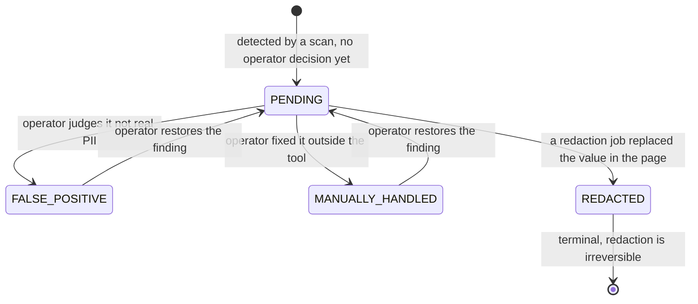

# Remediation workflow

Finding a PII value is half the product. The other half is what an operator does next: mark it a false
positive, mark it handled outside the tool, or **redact it in place inside the Confluence page**. That
is the `remediation` slice (`application/pii/remediation`, `infrastructure/pii/remediation`) and the
`/obfuscation` screen.

Master switch: `pii.remediation.enabled` (`PII_REMEDIATION_ENABLED`, default `true`). When false every
`/api/v1/pii/remediation/**` route except `GET /config` returns 403.

## Finding identity: the keystone

Everything here depends on one idea, and getting it wrong breaks the whole feature.
`domain/pii/remediation/FindingReference.java` derives a stable `findingId` as
`SHA-256(spaceKey \n pageId \n attachmentName \n piiType \n valueFingerprint)`.

What it deliberately **excludes**, and why:

- **`scanId` and character offsets** — both change on every re-scan; including them would orphan every
  remediation status and false-positive judgement after the next scan.
- **`severity`** — so recalibrating a PII type's severity does not invent new findings.
- **`detector`** — a false positive is a property of *this value at this location*, not of the engine
  that flagged it. A finding marked false positive must stay suppressed even when a different detector
  surfaces the same value later. `detector` is kept as denormalised metadata for auditing only.

`valueFingerprint` is computed by `HmacValueFingerprintAdapter`: HMAC-SHA256 over the value normalised
to Unicode NFC, trimmed, with whitespace runs collapsed. The MAC key is derived from the PII encryption
KEK through HKDF-SHA256 with a dedicated info label, so fingerprints live in a separate key domain from
encryption and the raw KEK is never used as a MAC key. Consequence: **a fingerprint is not portable
across deployments with different keys**, and rotating the KEK without re-deriving fingerprints orphans
remediation rows.

## Finding lifecycle



Enforced by `FindingRemediationStatus.canTransitionTo` / `transitionTo`, which throws
`IllegalStatusTransitionException` on an illegal move. `PENDING → REDACTED` is reachable **only** from a
redaction job, never from the status endpoint. Rows live in `pii_finding_remediation` (migration
`014-pii-finding-remediation.sql`); a finding with no row is implicitly `PENDING`, so the table stores
decisions, not findings.

Status changes go through `ChangeFindingStatusUseCase`, either per finding
(`POST /pii/remediation/findings/status`) or over a whole criteria-based selection
(`POST /pii/remediation/findings/status/by-selection` — that is the bulk "mark treated" / "report false
positive" path used by the bulk bar).

## False positives are suppressed twice, at two different times

Two complementary mechanisms, and knowing which one you are looking at saves a lot of confusion:

| Mechanism | When | Effect |
|---|---|---|
| `FalsePositiveDetectionFilter` (`application/pii/reporting/service`) | **Read time**, in `ScanReportingUseCase` | Hides findings flagged *after* the last scan, and adjusts the displayed counters by a delta computed from the finding's **frozen** severity |
| `ScanTimeFalsePositiveSuppressor` (`application/pii/remediation/service`) | **Write time**, in the scan flux | Findings flagged *before* a scan are never persisted, never counted, never streamed |

Scan-time suppression loads the space's false-positive ids **once** per space and applies a pure
in-memory reduction to every event, so scan events, severity counters, per-space statistics and the live
SSE view all consume the same reduced event — consistency at the source rather than only in the read
model. Both mechanisms are **fail-open**: an unreadable remediation projection means the scan runs
without suppression rather than failing.

The read-time delta uses the severity recorded on the remediation row, not a freshly derived one. That
is intentional: re-deriving severity after a taxonomy change would make the delta inconsistent with the
counters it subtracts from.

Marking false positives also regenerates the exported Excel report, so the file matches the triage —
`RemediationEventPublisherAdapter` publishes `SpaceFalsePositivesChanged` and
`SpaceFalsePositivesChangedListener` re-runs the export (commit `a5ad2b72`).

## Redaction: plan, execute, track

```
POST /pii/remediation/plan      → ObfuscationPlan   (read-only preview + checksum)
POST /pii/remediation/jobs      → ObfuscationJob    (starts the run)
GET  /pii/remediation/jobs/{id} → job status + per-finding outcomes
```

**Selection is criteria-based, not a list of ids.** `RemediationSelection` describes a scope
(space, optional page, severities, types, statuses) and `SelectionResolver` resolves it against the
**latest scan's** events, keeping only `PENDING` findings and partitioning out attachment findings as
explicit exclusions. It reads events in **encrypted mode only** — no plaintext is decrypted while
planning.

`PlanObfuscationUseCase` returns totals by severity, pages impacted, false positives reported,
attachment exclusions, and a **`selectionChecksum`** over the resolved finding ids. The checksum is
re-verified when the job starts: if the underlying data moved between preview and confirmation, the job
is refused with `SelectionOutdatedException` rather than redacting something the operator did not see.

`ObfuscationJobRunner` then works **page by page**:

1. Decrypt that page's PII values through the audited `AccessPurpose.REDACTION` path
   (`listItemEventsDecrypted`) — every decryption lands in `pii_access_audit`.
2. Pair each selected finding with its plaintext by `piiType|valueFingerprint`. A finding whose
   plaintext is not in the scan events is marked `FAILED` with reason
   *plaintext value unavailable in scan events*.
3. Hand `(value, token)` pairs to `SourcePageRedactionPort`. Tokens come from
   `RedactionToken.forType(piiType)`.
4. Record exactly one `FindingRedactionOutcome` per finding: `REDACTED`, `SKIPPED_VALUE_NOT_FOUND`,
   `SKIPPED_STALE` (page changed concurrently), `SKIPPED_ATTACHMENT`, or `FAILED`.
5. Persist `REDACTED` statuses; findings whose value was not found stay implicitly `PENDING`.

A failing page never stops the job — the job then ends `COMPLETED_WITH_ERRORS`. Job progress is written
after each page so the UI's progress bar advances. The runner never touches markup and never logs or
persists a plaintext value.

Job statuses: `RUNNING`, `COMPLETED`, `COMPLETED_WITH_ERRORS`, `FAILED`, `INTERRUPTED`. At most one
`RUNNING` job per space (a unique index scoped to running jobs). `ObfuscationJobBootRecovery` marks
jobs left `RUNNING` by a crashed process as `INTERRUPTED` at `ApplicationReadyEvent`, so they can be
relaunched idempotently: already-redacted findings are excluded by the resolver, and tokens already
written never re-match.

**Attachments cannot be redacted.** `AttachmentRedactionUnsupportedException` and the
`SKIPPED_ATTACHMENT` outcome make that explicit, and plans report the exclusions up front.

## Rewriting Confluence storage format safely

`StorageContentRedactor` (`infrastructure/pii/remediation/adapter/out`) is where all
storage-format knowledge is confined — callers only ever hand it plain `(value, token)` pairs. Its
problem: a detected value comes from *extracted text* and almost never matches the raw XHTML
byte-for-byte (entities, macros, CDATA, inline formatting, table cells).

Its approach, and the invariants that come with it:

- Matching happens on a **normalised concatenation of the document's text nodes** (entities decoded by
  the XML parser, whitespace variants collapsed, NFC), then matches are re-projected onto the original
  nodes: the token lands in the first covered node and covered fragments of following nodes are
  removed. That is what lets it redact a value split across `<strong>` or across table cells.
- **Longer values are applied before shorter ones**, so `"Doe"` can never shadow `"John Doe"`.
- Tokens already written never re-match, which is what makes a relaunched job idempotent.
- Non-content tags (`ac:parameter`, `ac:image`, `ac:emoticon`) are skipped; block-level tags define
  boundaries so a value cannot be "found" across two paragraphs.
- `mailto:` / `tel:` schemes are handled explicitly.
- Values are never logged; outcomes are correlated to inputs **by position**.

`ConfluencePageRedactionAdapter` performs the actual `PUT`, with optimistic concurrency on the page
version: a page that changed since the scan yields `STALE` rather than an overwrite. Historical trap
recorded in commit `95087f93`: preserving XML serialization and redacting longer values first were both
required to avoid corrupting pages.

## Counting semantics: two legitimate numbers

The dashboard and the obfuscation screen show different totals for the same space, and both are right:

- **Dashboard** counts **occurrences** — every detection event.
- **Obfuscation** groups by value and counts **distinct values**, showing an occurrence counter per
  group. Redaction operates on values, so this is the number that matches the work to be done.

Two corollaries for the frontend: pagination is **per group** (`totalGroups`), never over a flat finding
count; and a bulk action applies to the resolved *selection*, not to the currently displayed page of
groups.

## Changing this area

- Never add a field to `FindingReference`'s identity without deciding what it does to existing rows —
  any change invalidates every stored `findingId`.
- New status or transition: `FindingRemediationStatus` (+ its tests), the DTO/mapper, the UI filter
  options, and both i18n files.
- New redaction target (a new content format): implement `SourcePageRedactionPort`; keep format
  knowledge out of `ObfuscationJobRunner`.
- Relevant tests: `ObfuscationJobRunnerTest`, `SelectionResolverTest`,
  `ScanTimeFalsePositiveSuppressorTest`, `ChangeFindingStatusUseCaseTest`,
  `FalsePositiveDetectionFilterTest`, `DashboardFalsePositiveExclusionTest`,
  `ExportDetectionReportUseCaseTest`, `SpaceFalsePositivesChangedListenerTest`, and on the UI side the
  `pii-obfuscation` specs plus `e2e/obfuscation.spec.ts`.
- Background: `docs/issue-14/RAPPORT-SPIKE-TASK0.md` is the feasibility spike that decided in-place
  XHTML redaction was viable.
