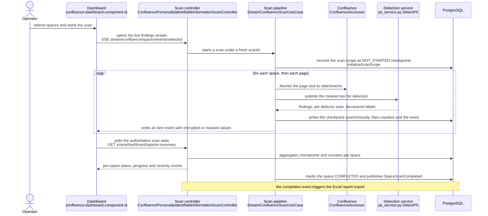
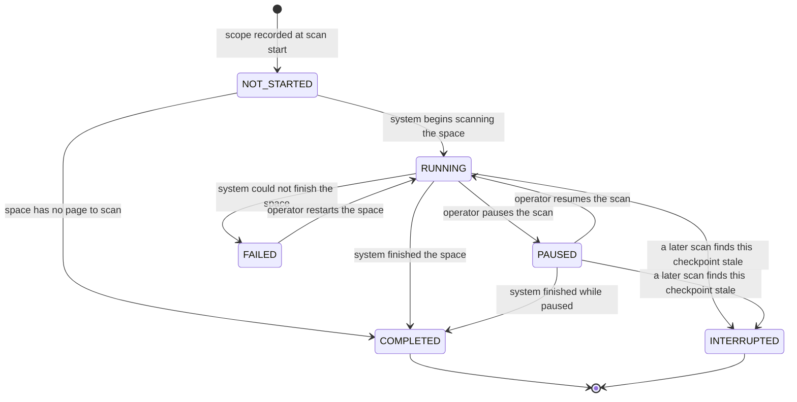

# Scan workflow

From "the operator clicks Start" to "the dashboard shows findings", plus the parts that took the most
iterations to get right: scan scope, statuses, pause, resume, and reconnection.

## End to end

The two channels are independent on purpose: the SSE stream carries findings, the poll carries state.
See [Frontend UI](../architecture/frontend-ui.md) for why.

## Starting a scan

Three entry points, all on `ConfluencePersonallyIdentifiableInformationScanController`:

| Route | Use case method | Semantics |
|---|---|---|
| SSE `GET /stream/confluence/space/{spaceKey}/events` | `streamSpace` | Single space |
| SSE `GET /stream/confluence/spaces/events` | `streamAllSpaces` | Every cached space |
| SSE `GET /stream/confluence/spaces/events/selected` | `streamSelectedSpaces` | An explicit selection |

Each **always mints a fresh `scanId` (a UUID)** and purges the previous active scan's data first
(`purgePreviousScanData` for a global scan, `purgePreviousScanDataForSpaces` for a selection). Resuming
is a different route; a start is never a resume.

The flux is registered with the orchestrator (`startScan`) and the caller subscribes to it
(`subscribeScan`). That indirection is what lets a second client — or the same client after a reload —
attach to a running scan instead of launching a competing pipeline.

Spaces come from the **cached** `confluence_spaces` table, refreshed every 5 minutes by
`ScheduledConfluenceSpaceCacheRefreshJob`. A space created in Confluence a minute ago is not
selectable yet.

## Scan scope is persisted, and why

Before scanning anything, `initializeScanScope(scanId, spaceKeys)` writes a `NOT_STARTED` checkpoint
for **every space in the scope**. The checkpoints of a `scanId` *are* the scope.

This is not an optimisation; it is the structural fix for a family of six confirmed bugs
(`qa/scan-status-bugs/`, fixed in commit `a36f87df`). Before it, the scope of a "selection" scan lived
only in a frontend in-memory signal: reloading the page during a scan lost it, a resume leaked into
every space in the database, and "En attente" badges appeared on spaces that belonged to no scan.
`SpaceSummary` now also carries the `scanId` per space, so the frontend can rebuild the scope after a
reload from the statuses themselves.

**Read `qa/scan-status-bugs/FIXES-REPORT.md` before changing anything in this area.** It documents each
bug, the fix, and the reason a simpler alternative was rejected.

## Per-space status machine

`ScanStatus` (`domain/pii/ScanStatus.java`) and its transition rules
(`domain/pii/scan/ScanCheckpointStatusTransition.java`, business rule `BR-SCAN-001`):

Notes that matter:

- Transitions are **initiator-aware**: `RUNNING → PAUSED` and `PAUSED → RUNNING` require
  `Initiator.USER`; `→ COMPLETED` and `→ FAILED` require `Initiator.SYSTEM`. Same-status transitions are
  always allowed (idempotence).
- `COMPLETED` is the only entry in `FINAL_STATES` and admits no outgoing transition.
- `NOT_STARTED → COMPLETED` exists **only** for the empty-space case: a space with no page emits just
  the space-level `complete` event, and without this transition the upfront checkpoint would stay
  `NOT_STARTED` for ever, so the UI would never detect completion and would reconnect in a loop.
- `INTERRUPTED` is set by `resolveStaleActiveCheckpoints` when a new scan finds leftover
  `RUNNING`/`PAUSED` checkpoints from a dead scan. It replaced forcing them to `COMPLETED`, which
  displayed "OK / 100 %" over a space scanned to 40 % — silently hiding PII. Deleting them was not an
  option: `scan_severity_counts` cascades on delete and the counters would be destroyed.
- **`PENDING` is not a backend status.** "En attente" is derived in the frontend
  (`scan-status.utils.ts`) from a `NOT_STARTED` checkpoint carrying the current `scanId`. That
  derivation is only reliable because of the upfront checkpoints; any change to the scope mechanism
  breaks the badge.

## Events

`ScanEventType` values (`domain/pii/scan/ScanEventType.java`) with their wire names:
`multiStart`, `start`, `pageStart`, `item`, `attachmentItem`, `pageComplete`, `scanError`, `complete`,
`multiComplete`, `keepalive`.

`item` and `attachmentItem` carry the findings and are the only ones the frontend's SSE handler
consumes. Every event is appended to `scan_events` (JSONB payload, PII values encrypted) and updates
`scan_checkpoints`. `complete` additionally publishes a domain event after transaction commit
(`ScanEventDispatcher.publishAfterCommit`), which is what triggers the Excel export.

## Pause and resume

`POST /stream/{scanId}/pause` transitions the running checkpoints to `PAUSED` and disposes the
pipeline's subscription. Disposal is the discriminator used later on.

`POST /stream/{scanId}/resume` → `StreamConfluenceResumeScanUseCase.resumeAllSpaces(scanId)`:

1. If `isScanActive(scanId)` — the orchestrator still manages a live, non-disposed subscription — it
   **attaches** to it (`subscribeScan`) and replays the buffered events. Zero new work. This is what
   makes a browser refresh during an active scan harmless; previously it started a second pipeline and
   double-counted severities.
2. Otherwise the real resume pipeline runs, scoped by `scanCheckpointRepository.findByScan(scanId)` —
   the persisted scope. Spaces are filtered to those keys, and an unknown `scanId` yields
   `Flux.empty()` with a warning rather than a full re-scan.
3. Per space, `computeRemainingPages(pages, checkpoint)` decides what is left. A `NOT_STARTED`
   checkpoint yields every page, so a space in scope that was never reached is scanned in full.

## Reconnection after a reload

Two layers cooperate:

- **Short term**: `ScanEventBuffer` keeps the last 1000 events per scan in memory and replays them to a
  reattaching client, ordered by `ScanEventSequencer`.
- **Long term**: `scan_checkpoints` in PostgreSQL.

On the frontend, `reconnectIfScanRunning()` reconnects when the current scan has at least one
**non-terminal** space (`RUNNING` or `NOT_STARTED` under the current `scanId`), never when a `PAUSED`
space of that scan exists, never when everything is terminal. Gating on a `RUNNING` snapshot instead
missed the window *between* two spaces and left the dashboard showing an idle scan with frozen badges.

## Counters and statistics

Four independent aggregates, all incremental and written asynchronously:

| Table | Written by | Grain |
|---|---|---|
| `scan_severity_counts` | `ScanSeverityCountService` | scan × space × severity |
| `scan_pii_type_counts` | `ScanPiiTypeCountService` | scan × space × PII type |
| `scan_space_stats` | `ScanSpaceStatsCollector` | scan × space throughput |
| `scan_detector_stats` | `ScanSpaceStatsCollector` | scan × space × detector, from `DetectorRunStats` |

They are *additive*, which is exactly why the checkpoint must be synchronous: a re-scanned page
increments them twice. Failures inside a collector are swallowed so a statistics problem can never fail
a scan.

Severity is computed by `SeverityCalculationService` from the PII type's configured severity; findings
already marked false positive are removed **before** any counter sees them
(`ScanTimeFalsePositiveSuppressor`), so the dashboard totals match the triage.

## Timeouts and failure modes

| Symptom | Where to look |
|---|---|
| `PII detection timeout (Reactor)` events | `scan.timeouts.pii-detection` (1810s) vs the gRPC timeouts (30 min) — Reactor is intentionally the looser bound |
| `PII detection failed (gRPC …)` events | Detector reachability, `pii-detector.host/port`, detector logs |
| Scan completes with zero findings | Detector cannot reach the database (`DB_HOST` defaults to `postgres`) or all detectors are disabled in `pii_detection_config` |
| Attachment skipped | `AttachmentTypeFilter` and the Tika/PDFBox extractors; errors become `scanError`, not failures |
| Findings visible in logs but absent from the dashboard | Grep `[FINDING_TRACKER]` in the detector logs to find the stage that dropped them, then the type gate and post-filter in [Detection pipeline](../architecture/detection-pipeline.md) |

## Changing the scan pipeline

- Read `AbstractStreamConfluenceScanUseCase` in full first; the comments are the design record.
- Never make checkpoint persistence asynchronous.
- Keep the emission order: `flatMapSequential` bounded by `pageConcurrency`, with `.index()` applied
  before the concurrent region.
- Adding a status or transition means: `ScanStatus`, `ScanCheckpointStatusTransition` (+ its tests),
  `SpaceStatusMapper`/`UiStatusMapper`, the frontend `scan-status.utils.ts` mapping, filter options, and
  the `fr.json` / `en.json` labels.
- Relevant tests: `StreamConfluenceScanUseCaseTest`, `ContentScanOrchestratorTest`,
  `ScanEventFactoryTest`, `ScanCheckpointPersistenceAdapterIT`,
  `ScanSeverityCountPersistenceAdapterIT`, and on the UI side
  `scan-status-polling.service.spec.ts`, `sse-event-handler.service.spec.ts`,
  `spaces-dashboard.utils.spec.ts`.
